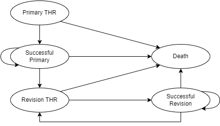

# DMHEE_THR
The goal of this repo is to develop and execute the Total Hip Replacement (THR) 
model from the DMHEE textbook. This exercise was developed in response to the
observation that the textbook is written and organized for a spreadsheet 
environment. A different approach is required when using a programming language 
like R. 

Source Text: 
1. Briggs AH, Claxton K, Sculpher MJ. Decision modelling for health economic
evaluation. Oxford: Oxford University Press; 2006. 237 p. (Briggs A, Gray A, 
editors. Oxford handbooks in health economic evaluation). 

# Model Summary
Briggs et al. reported on the development of a Markov model which was used to 
predict the prognosis of patients who have undergone primary total hip 
replacement (THR) surgery (2). A diagrammatic representation of the model 
is presented below: 

The model is conceptualized in terms of five Markov States: 

Primary THR (`PRI_THR`)
  : All patients begin the model with a primary THR procedure. 
  
Successful Primary (`PRI_Success`)
  : Patients transition to this state if their primary THR was successful. 
  
Revision THR (`REV_THR`)
  : This state represents those patients for whom a revision hip replacement is 
  required due to failure. Failure may be attributed to infection or loosening. 
  While patients can only remain in this state for one cycle, they can revisit 
  this state more than once. This is meant to reflect the fact that some 
  patients may require more than one revision operation. 
  
Successful Revision (`REV_Success`)
  : Patients transition to this state if their revision THR was successful. 
  
Death (`Death`)
  : The model assumes that patients can die at any point in the model. 
  Transitions can be attributed to operative mortality or the underlying risk of 
  death (given age and gender). 
  
The model assumes a cycle length of 1 year. It will be evaluated over time 
horizon of 60 years to estimate the lifetime costs and benefits of each 
intervention. Benefits of the intervention were measured in terms of Quality 
Adjusted Life Years. 

## Model Parameters

* Costing
  - Cost parameters were organized into two distinct groups: 
    - i) The unit cost for each prosthesis considered in the economic 
    evaluation. These values were originally obtained from manufacturer list 
    prices. 
    - ii) The costs incurred at each markov state. These values were identified 
    in a review of the different units involved in THR procedures. A successful 
    primary or revision THR was assumed to incur the same cost. Meanwhile, the 
    cost of a primary THR was set to 0 since all patients will travel through 
    this health state. The original review found that the cost of a revision 
    THR was 5294 GBP (SE 1487). 
* Utilities
  - According to the Briggs textbook, a study was initiated to identify the 
  utility weights subjects placed on different outcomes of THR. These outcomes 
  were directly related to the Markov States of the THR model. The respective 
  mean (SD) utilities were specified as: 
    - Successful Primary THR (`PRI_Success`): 0.85 (0.03)
    - Successful Revision THR (`REV_Success`): 0.75 (0.04)
    - Revision THR (`REV_THR`): 0.30 (0.03)

2. Briggs A, Sculpher M, Dawson J, Fitzpatrick R, Murray D, Malchau H. Modelling 
the cost-effectiveness of primary hip replacement: how cost-effective is the 
Spectron compared to the Charnley prosthesis? 2003 Dec;52. 

# Project Organization
TODO: Provide an explanation for how the project is organized here. 

# Progress
:white_check_mark: Complete
:warning: In-Progress
:x: Ice-Box.

## :warning: Develop THR Model

* :warning: Prepare Parameter Inputs from raw data. 
  - :white_check_mark: Transition Probabilities
    - :white_check_mark: Add raw data to `data/data-raw`. 
    - :white_check_mark: `getParams()` function to prepare parameter input list.
    - :white_check_mark: Generate Parameters from raw data. 
  - :warning: Costs
    - :white_check_mark: Add state costs to `data/data-raw`. 
    - :white_check_mark: Add costs for each prosthesis (`STD`, `NP1`).
    - :white_check_mark: Update `getParams()` to add new costing parameters. 
    - :white_check_mark: Re-generate `data/data-gen/Model-Params/THR-Params.rds` 
    with costing parameters. 
  - :warning: Utilities
    - :white_check_mark: Add raw data sets to `data/data-raw`. 
    - :white_check_mark: Update `getParams()` to add new utility parameters. 
    - :white_check_mark: Re-generate `data/data-gen/Model-Params/THR-Params.rds` 
    with utility parameters. 

* :warning: Develop Model Code | `runModel()`. 
  - :white_check_mark: Function to define the transition Matrix. `define_tmat()`. 
    - :white_check_mark: Time-Independent Model Parameters
    - :white_check_mark: Time-Dependent Model Parameters. `calc_TimeDeps()`
      - :white_check_mark: Age specific Mortality Risk `calc_MR`. 
      - :white_check_mark: Revision Risk as a function of Age, Sex, Time. `calc_RR()`. 
  - :white_check_mark: Function to track the cohort through the model. `track_cohort()`. 
  - :white_check_mark: Function to estimate Costs: `cohort_costs()`. 
      - :white_check_mark: Add discounting to `cohort_costs()` function. 
  - :x: Function to estimate effects. `cohort_effects()`. Will return effects 
  measured in terms of Life Years (`LYs`) and QALYs (`QALY`). 
    - :x: Add discounting to `cohort_effects()` function. 

## :x: Perform Simulations

### :x: Adoption Decision
* :x: Deterministic Simulation
  - Save to `data/data-gen/Simulation-Output` directory as `THR_Deter.rds`. 
* :x: Monte Carlo Simulation (5,000 iterations)
  - Save to `data/data-gen/Simulation-Output` directory as `THR_MC-Sim_5000.rds`

### :x: Research Decision
* :x: Nested Monte Carlo Simulation. 
  - Save to `data/data-gen/Simulation-Output` directory as `THR_Nested-MC_param.rds`
  
## :x: Analyze Simulation Results

### :x: Adoption Decision

* :x: Deterministic - Calculate ICER. 
* :x: Probabilisitc
  - :x: Perform Incremental Analysis
  - :x: Net-Benefits Analysis. 
  - :x: Prepare CEA Results Table. 
  - :x: Plot Cost-Effectiveness Plane. 
  - :x: Plot CEAC. 
  
### :x: Research Decision
* :x: Implement VoI Methods. 
  - :x: Calculate EVPI (per-patient and population). 
  - :x: Calculate EVPPI (per-patient and population). 
  - :x: Plot EVPI and EVPPI as a function of cost-effectiveness threshold. 