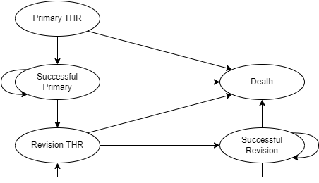

# Model Summary

Originally developed by Briggs et al.[^2], the Total Hip Replacement Model
predicts the prognosis of patients who have undergone a primary THR procedure. 
The model was used to compare the cost-effectiveness of a standard prosthesis 
against one (`NP1`) or two (`NP1` & `NP2`) new prostheses. This is accomplished 
using a Markov structure, which is presented graphically below. 

The model is designed to track patients through specific Markov states to 
estimate the costs and benefits of each intervention over a specified time 
horizon. Cycle lengths in the model are assumed to be 1 year and benefits were 
measured in terms of Quality Adjusted Life Years (`QALYs`). The conceptualized 
model included five distinct Markov States: 

Primary THR (`PRI_THR`)
  : All patients begin the model having undergone a primary total hip 
  replacement. 
  
Successful Primary (`PRI_Success`)
  : Patients transition to this state if their primary THR was successful.

Revision THR (`REV_THR`)
  : This state represents those patients from whom a revision hip replacement 
  is required due to failure. Failure of the primary THR is assumed to be 
  attributed to infection or loosening. While patients can only stay in this 
  state for one cycle, they can revisit it more than once. This is meant to 
  reflect the fact that some patients may require more than one revision 
  operation. 
  
Successful Revision (`REV_Success`)
  : Patients transition to this state if their revision THR was successful. 
  
Death (`Death`)
  : The model assumes that patients can die at any point over the specified 
  time horizon. Transitions can be attributed to operative mortality or the 
  underlying risk of death (given age and gender). 

## Input Parameters
The THR model included input parameters which affected the probability of 
[transitioning between markov states](#transition-probabilities), 
[costs](#costs), and [health state utilities](#health-state-utilities). A 
description of each is provided in the sub-sections below. 

### Transition Probabilities

Operative Mortality Rate (OMR)
  : The risk of death when undergoing a Primary THR or a Revision THR. 
  
Revision Risk (RR)
  : The risk of a revision procedure following primary THR. 
  
Re-Revision Risk (RRR)
  : The risk of a revision procedure following a revision THR. 
  
Mortality Risk (MR)
  : The age and gender specific risk of death, as estimated from national life 
  tables. 

### Costs
Two types of cost parameters were considered in this economic evaluation. 

Unit Costs
  : Refers to the unit cost of each prosthesis included in the economic 
  evaluation. These values were originally obtained from manufacturer list 
  prices.  
  
Markov State Costs
  : Refers to the costs incurred at each markov state. These values were 
  identified in a review of the different units involved in the THR procedures. 
  A successful primary or revision THR was assumed to incur the same cost. 
  Meanwhile, the cost of a primary THR was set to 0 since all patients will 
  travel through this health state. The original review found that the cost of 
  a revision THR was &pound; 5294 (SE 1487).  

### Utilities
The economic evaluation considered one set of utility parameters. 

Utilities
  : As reported in the textbook where this exercise was sourced [^2], a study 
  was initiated to identify the utility weights patients placed on different 
  outcomes from THR. These outcomes were consistent with the Markov states 
  conceptualized for the THR model. The respective mean (SD) utilities were 
  reported to be: 
  - Successful Primary THR: 0.85 (SD 0.03)
  - Successful Revision THR: 0.75 (SD 0.04)
  - Revision THR: 0.30 (SD 0.03)

[^1]: Briggs A, Sculpher M, Dawson J, Fitzpatrick R, Murray D, Malchau H. 
Modelling the cost-effectiveness of primary hip replacement: how
cost-effective is the Spectron compared to the Charnley prosthesis? 
2003 Dec;52. 
[^2]: Briggs AH, Claxton K, Sculpher MJ. Decision modelling for health economic
evaluation. Oxford: Oxford University Press; 2006. 237 p. (Briggs A, Gray A, 
editors. Oxford handbooks in health economic evaluation).